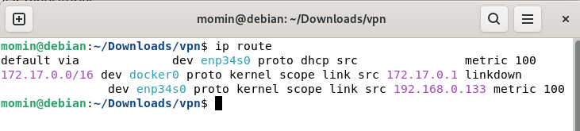
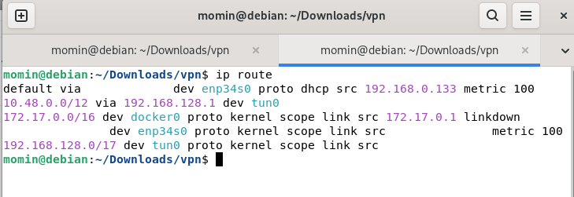
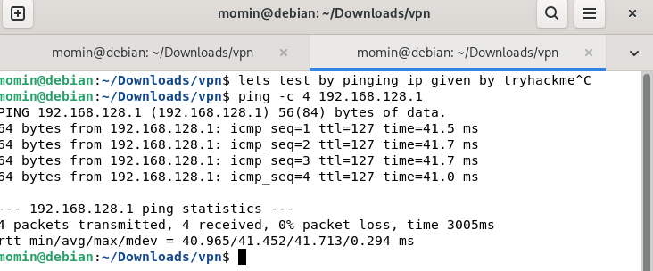

# Remote Network Connectivity — OpenVPN Lab

## What I did
Connected to TryHackMe's private lab network using OpenVPN
on Debian Linux to access remote machines for practice.

## Tools Used
- OpenVPN 2.6.14
- Debian Linux
- ip route 

## What I learned
- OpenVPN creates a virtual tun0 interface on connection
- New routes added to reach TryHackMe private network
- Without VPN the lab machines are unreachable

## Before VPN

## After VPN

## Ping Test

